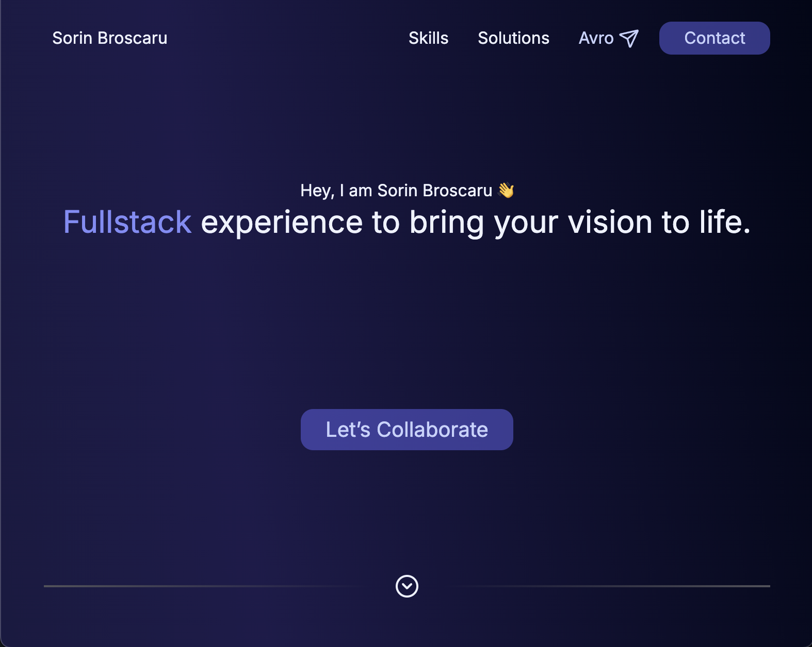

# broscaru.eu


**A simple serverless app where I host my own things.**

---

## 📝 Table of Contents

- [About](#about)
- [Features](#features)
- [Demo](#demo)
- [Installation](#installation)
- [Usage](#usage)
- [Technologies](#technologies)
- [Contributing](#contributing)
- [License](#license)

---

## 📖 About

**Broscaru.eu** is a full stack, serverless, application meant to live under broscaru.eu and it's main purpose is to provide a working example / model of the deployed website.

---

## 🌟 Features

- **Feature 1** - Lading page of broscaru.eu and my presentation website
<!-- - **Feature 2** - Describe another feature
- **Feature 3** - Mention any highlights, such as performance, tech stacks, etc. -->
- **More to come!** - Future plans: add a blog section, add a CV section.

---

## 🚀 Demo

[Broscaru.eu](https://www.broscaru.eu)

Example screenshot:


---

## ⚙️ Installation

1. Clone the repository:
   ```bash
   git clone https://github.com/avrosorin/broscarueu.git
   ```
2. Change to the project directory:
   ```bash
   cd broscarueu
   ```
3. Install dependencies:

   ```bash
    deno install --allow-scripts
   ```

   or

   ```bash
   npm install
   ```

4. Start the application in development node:
   ```bash
   deno task dev
   ```

---

## 🎮 Preview

Explain how to use the project, with some example commands or links to further documentation if needed.

```bash
# Preview
deno task build
wrangler pages dev
```

---

## 🛠 Technologies

- **Frontend**: [Svelte & Svelte KIT]
- **Backend**: [Sveltekit with Cloudflare pages adapter]
- **Other Technologies**: [Tailwind]

---

## 🤝 Contributing

Contributions are not permited as this is more of a demo project.

---

## 📄 License

This project is licensed under the MIT License - see the [LICENSE](LICENSE) file for details.

---

## 🙏 Acknowledgements

- Svelte 5 & SvelteKit & Cloudflare workers
